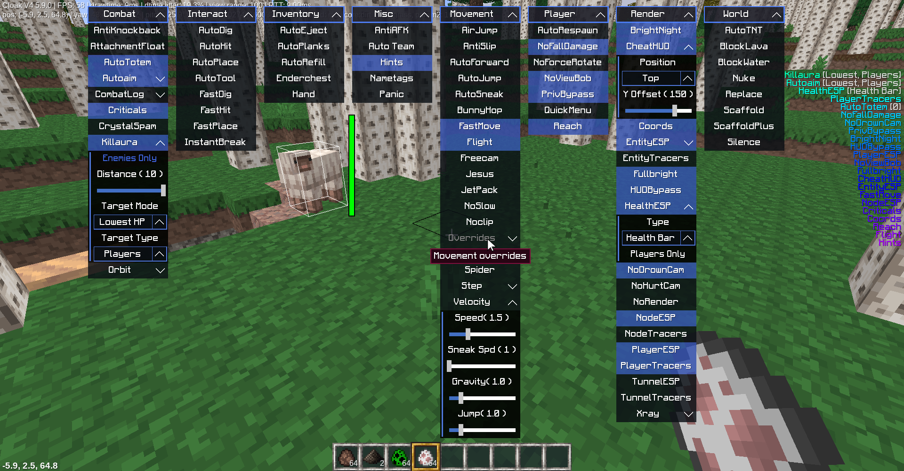

<<<<<<< HEAD
Cloak V4
==============

A minetest cheat client based off of [Chimeraclient](https://github.com/plus-22/chimeraclient/), which draws its roots from [OtterClient](https://github.com/otterminetest/OtterClient/).

This client's name is based off of TeamAcedia's previous clients, CloakV3, CloakV2, and Cloak

### Important info:
This client includes almost all CSM api additions from dragonfire, although it hasn't been documented (yet). It also includes many built-in client side mods and a new minimalistic design for the cheat menu.
It has not been tested extensively, so it may not be stable. If any bug or error is found, please open an issue about it.

### Core devs:
  - [ProunceDev](https://github.com/ProunceDev)
  - [FoxLoveFire](https://github.com/FoxLoveFire)
  - [Plus-22](https://github.com/plus-22)
  - [Pl608](https://github.com/PL608wastaken)

# Features
### Menus
  - Quick Menu: Dragonfire cheat menu. Use arrow keys to navigate through it and enter key to toggle cheats.
  - Click Menu: Use F8 key to open it. It displays different windows for each category. Each window can be moved. This menu was first implemented in [MineBoost Client](https://www.github.com/FoxLoveFire/MineBoost) by [Maintainer_ / FoxLoveFire](https://github.com/FoxLoveFire/), all credit goes to him.

Menus can be toggled with the "QuickMenu" cheat in Player category.

### Cheats

  
Combat

  - AntiKnockback
  - AttachmentFloat: float above parent.
  - AutoAssist: don't completely kill your enemies. Turning this on automatically turns on PlayerAura.
  - AutoTotem: automatically puts a totem in your offhand. WARNING: Don't use on non-mcl servers.
  - AutoAim: aims at the nearest player.
  - CrystalSpam: automatically puts end crystals at another player's position and detonates it.
  - EntityAura: auto-hit entities.
  - PlayerAura: auto-hit enemy players.

  
Interact

  - AutoDig: automatically dig pointed block
  - AutoHit: automatically hit pointed entity
  - AutoPlace: automatically place wielded item at pointed block
  - AutoTool: automatically select best tool for digging/hitting
  - FastDig: dig at 10x speed
  - FastHit: hit at 6x speed. Can be modified using the `.fasthit <multiplier>` chat command
  - FastPlace: instant block placing
  - InstantBreak: instant block breaking

  
Inventory

  - AutoEject
  - AutoPlanks
  - AutoRefill
  - EnderChest
  - Hand

  
Movement

  - AirJump: jump while in the air
  - AutoForward
  - AutoJump
  - AutoSneak: autosneak. This hides your nametag on some servers.
  - FastMove
  - Flight
  - Freecam
  - GravityOverride
  - Jesus
  - JetPack
  - JumpOverride
  - Noclip
  - NoSlow
  - PitchMove
  - SpeedOverride
  - Spider: climb walls

  
Player

  - AutoRespawn
  - NoFallDamage
  - Reach: extend interact distance
  - PrivBypass
  - QuickMenu: switch from the click menu (new) to the quick menu (old)

  
Render

  - CheatHUD: show currently toggled cheats
  - Coords: show coords in bottom left of screen
  - EntityESP: show bounding boxes around entities
  - EntityTracers: show lines to entities
  - Fullbright
  - HUDBypass
  - NoDrownCam
  - NoHurtCam
  - NodeESP: can be configured using the `.search add <(optional) node_name>` chat command
  - NodeTracers: can be configured using the `.search add <(optional) node_name>` chat command
  - NoRender: skip rendering particles to reduce client lag
  - PlayerESP: show bounding boxes around players. Green = friendly, Red = enemy. Friends can be configured using the `.friend add <(optional) player_name>` chat command.
  - PlayerTracers: show lines to players. Green = friendly, Red = enemy. Friends can be configured using the `.friend add <(optional) player_name>` chat command.
  - TunnelESP: shows tunnels.
  - TunnelTracers: show lines to tunnels.
  - Xray: see blocks thru walls. Can be configured using the `.xray add <(optional) node_name>` chat command.

  
World

  - AutoTNT: switches to TNT and places it
  - BlockLava: puts blocks where lava is
  - BlockWater: puts blocks where water is
  - DigCustom: Digs custom nodes. Can be configured using the `.digcustom del | <item> | add <item> | list | clear` chat command.
  - Nuke
  - Replace
  - Scaffold
  - ScaffoldPlus
  - Silence

### Chat commands
- `.fasthit <multiplier>` set fasthit multiplier. FastHit needs to be turned on for this to be used.
- `.say <text>` send raw text
- `.tp <X> <Y> <Z>` teleport
- `.wielded` show itemstring of wielded item
- `.players` list online players
- `.kill` kill your own player
- `.sneak` toggle autosneak
- `.speed <speed>` set speed
- `.place <X> <Y> <Z>` place wielded item
- `.dig <X> <Y> <Z>` dig node
- `.break` toggle instant break
- `.setyaw <yaw>`
- `.setpitch <pitch>`
- `.respawn` respawn while in ghost mode
- `.xray`
    - `add <(optional) node_name>`: add a node to xray configuration (to see thru it). Can either add by node_name or by pointing at a node.
    - `del <(optional) node_name>`: remove a node from xray configuration
    - `list`: list xray nodes
    - `clear`: clear xray nodes
- `.search`
    - `add <(optional) node_name>`: add a node to nodeESP search. Can either add by node_name or by pointing at a node.
    - `del <(optional) node_name>`: remove a node from nodeESP search
    - `list`: list nodeESP nodes
    - `clear`: clear nodeESP nodes
- `.friend`
    - `add <(optional) player_name>`: add a friend. Can either add by player_name or by pointing at a player. Friends are server-specific.
    - `del <(optional) player_name>`: remove a friend
    - `list`: list all friends for the current server
    - `clear`: remove all friends for the current server
- `.ctf`
    - `add`: add current server to ctf servers list
    - `del`: delete current server from ctf servers list
    - `list`: view ctf servers list
    - `clear`: clear ctf servers list

# Compiling
- [Compiling on GNU/Linux](doc/compiling/linux.md)
- [Compiling on Windows](doc/compiling/windows.md)
- [Compiling on MacOS](doc/compiling/macos.md)
- [Compiling on Android](doc/android.md)
=======
Luanti (formerly Minetest)
==========================

Luanti is a free open-source voxel game engine with easy modding and game creation.

Copyright (C) 2010-2024 Perttu Ahola <celeron55@gmail.com>
and contributors (see source file comments and the version control log)

Table of Contents
------------------

1. [Further Documentation](#further-documentation)
2. [Default Controls](#default-controls)
3. [Paths](#paths)
4. [Configuration File](#configuration-file)
5. [Command-line Options](#command-line-options)
6. [Compiling](#compiling)
7. [Docker](#docker)
8. [Version Scheme](#version-scheme)

Further documentation
----------------------
- Website: https://www.minetest.net/
- Wiki: https://wiki.minetest.net/
- Forum: https://forum.luanti.org/
- GitHub: https://github.com/minetest/minetest/
- [Developer documentation](doc/developing/)
- [doc/](doc/) directory of source distribution

Default controls
----------------
All controls are re-bindable using settings.
Some can be changed in the key config dialog in the settings tab.

| Button                        | Action                                                         |
|-------------------------------|----------------------------------------------------------------|
| Move mouse                    | Look around                                                    |
| W, A, S, D                    | Move                                                           |
| Space                         | Jump/move up                                                   |
| Shift                         | Sneak/move down                                                |
| Q                             | Drop itemstack                                                 |
| Shift + Q                     | Drop single item                                               |
| Left mouse button             | Dig/punch/use                                                  |
| Right mouse button            | Place/use                                                      |
| Shift + right mouse button    | Build (without using)                                          |
| I                             | Inventory menu                                                 |
| Mouse wheel                   | Select item                                                    |
| 0-9                           | Select item                                                    |
| Z                             | Zoom (needs zoom privilege)                                    |
| T                             | Chat                                                           |
| /                             | Command                                                        |
| Esc                           | Pause menu/abort/exit (pauses only singleplayer game)          |
| +                             | Increase view range                                            |
| -                             | Decrease view range                                            |
| K                             | Enable/disable fly mode (needs fly privilege)                  |
| J                             | Enable/disable fast mode (needs fast privilege)                |
| H                             | Enable/disable noclip mode (needs noclip privilege)            |
| E                             | Aux1 (Move fast in fast mode. Games may add special features)  |
| C                             | Cycle through camera modes                                     |
| V                             | Cycle through minimap modes                                    |
| Shift + V                     | Change minimap orientation                                     |
| F1                            | Hide/show HUD                                                  |
| F2                            | Hide/show chat                                                 |
| F3                            | Disable/enable fog                                             |
| F4                            | Disable/enable camera update (Mapblocks are not updated anymore when disabled, disabled in release builds)  |
| F5                            | Cycle through debug information screens                        |
| F6                            | Cycle through profiler info screens                            |
| F10                           | Show/hide console                                              |
| F12                           | Take screenshot                                                |

Paths
-----
Locations:

* `bin`   - Compiled binaries
* `share` - Distributed read-only data
* `user`  - User-created modifiable data

Where each location is on each platform:

* Windows .zip / RUN_IN_PLACE source:
    * `bin`   = `bin`
    * `share` = `.`
    * `user`  = `.`
* Windows installed:
    * `bin`   = `C:\Program Files\Minetest\bin (Depends on the install location)`
    * `share` = `C:\Program Files\Minetest (Depends on the install location)`
    * `user`  = `%APPDATA%\Minetest` or `%MINETEST_USER_PATH%`
* Linux installed:
    * `bin`   = `/usr/bin`
    * `share` = `/usr/share/minetest`
    * `user`  = `~/.minetest` or `$MINETEST_USER_PATH`
* macOS:
    * `bin`   = `Contents/MacOS`
    * `share` = `Contents/Resources`
    * `user`  = `Contents/User` or `~/Library/Application Support/minetest` or `$MINETEST_USER_PATH`

Worlds can be found as separate folders in: `user/worlds/`

Configuration file
------------------
- Default location:
    `user/minetest.conf`
- This file is created by closing Luanti for the first time.
- A specific file can be specified on the command line:
    `--config <path-to-file>`
- A run-in-place build will look for the configuration file in
    `location_of_exe/../minetest.conf` and also `location_of_exe/../../minetest.conf`

Command-line options
--------------------
- Use `--help`

Compiling
---------

- [Compiling - common information](doc/compiling/README.md)
- [Compiling on GNU/Linux](doc/compiling/linux.md)
- [Compiling on Windows](doc/compiling/windows.md)
- [Compiling on MacOS](doc/compiling/macos.md)

Docker
------

- [Developing minetestserver with Docker](doc/developing/docker.md)
- [Running a server with Docker](doc/docker_server.md)

Version scheme
--------------
We use `major.minor.patch` since 5.0.0-dev. Prior to that we used `0.major.minor`.

- Major is incremented when the release contains breaking changes, all other
numbers are set to 0.
- Minor is incremented when the release contains new non-breaking features,
patch is set to 0.
- Patch is incremented when the release only contains bugfixes and very
minor/trivial features considered necessary.

Since 5.0.0-dev and 0.4.17-dev, the dev notation refers to the next release,
i.e.: 5.0.0-dev is the development version leading to 5.0.0.
Prior to that we used `previous_version-dev`.
>>>>>>> 5.10.0
